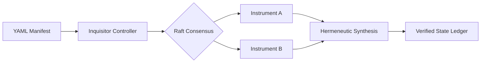
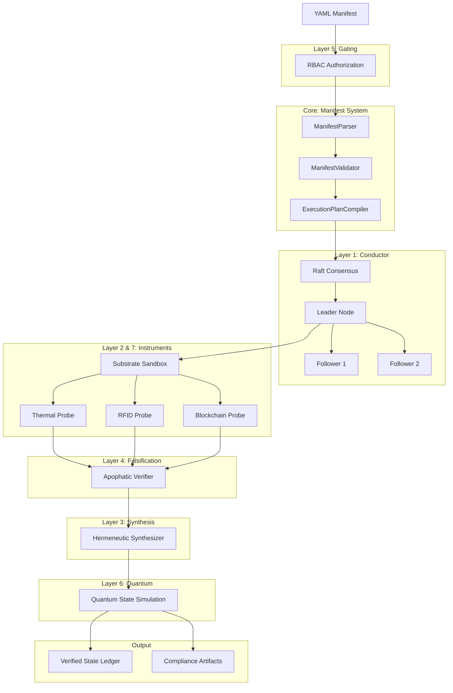

# Apparatus System Harness: Kubernetes-Native Inquiry Systems
### Infrastructure as Code for Immutable Provenance



[](#)
[](#)
[](#)

## 🏛️ Grounding: The Production Integrity Problem
Modern distributed systems suffer from **configuration drift** and **unverified state transitions**. Traditional imperative deployments create "invisible failures" where the actual runtime state diverges from the intended design, compromising audit trails and fault tolerance.

**Apparatus System Harness solves this through declarative Kubernetes-native orchestration that eliminates configuration drift.**

> **Production Case Study**: We use pharmaceutical cold-chain logistics as a provenance module—a domain where micro-fluctuations in temperature or humidity provide measurable test cases for distributed state verification.

## 🔧 Manifest-Over-Code Philosophy

The system state is **entirely defined by declarative YAML manifests**, ensuring:

- **Zero Configuration Drift**: Runtime state always matches declared intent
- **Immutable Audit Trails**: Every state transition is version-controlled and cryptographically verifiable
- **Reproducible Deployments**: Identical manifests produce identical systems across environments
- **GitOps-Native**: All changes flow through pull requests with automated validation

```yaml
# Example: Inquiry Manifest defines both infrastructure AND behavior
apiVersion: apparatus.wadelabs.io/v1
kind: InquiryManifest
metadata:
  name: cold-chain-verification
spec:
  instruments:
    - type: thermal
      probeInterval: 10s
    - type: rfid
      probeInterval: 30s
  arbitration:
    engine: hermeneutic
    consensus: raft
```

## 🚀 7-Layer Complexity Architecture

1.  **HA Conductor (Raft)**: (Layer 1) Distributed leader election ensuring that inquiry orchestration persists even if 49% of monitoring nodes fail.
2.  **Holonic gRPC Instruments**: (Layer 2) Modular probe system allowing rapid deployment of new protocols (Thermal, RFID, Blockchain) without downtime.
3.  **Hermeneutic Synthesis Engine**: (Layer 3) Advanced arbitration logic that resolves conflicting data from diverse sources to find the "Ground Truth".
4.  **Apophatic Falsification Engine**: (Layer 4) Eliminates data corruption by rigorously excluding any findings that violate physical or logistical axioms.
5.  **Multi-Tenant Manifest Gating**: (Layer 5) RBAC-secured inquiry cycles allowing multiple stakeholders to collaborate on a single verifiable timeline.
6.  **Quantum State Simulation**: (Layer 6) Probabilistic state tracking for intermittent sensors, preventing "False Positives" in compliance reporting.
7.  **Substrate Sandboxing**: (Layer 7) Isolated execution of unverified probes to protect core infrastructure from hostile sensor exploits.

## 🏗️ Architecture Overview

Detailed explanation of each layer with architectural context:

### Layer 1: HA Conductor (Raft Consensus)
- **Location**: `src/inquisitor/conductor/`
- **Purpose**: Distributed leader election using Raft protocol
- **Capabilities**:
  - Ensures 2f+1 fault tolerance (survives f failures)
  - Replicates manifest state across cluster nodes
  - Handles node failures and leadership transitions
  - Maintains consistency across distributed inquiries
- **Key Component**: `InquisitorConductor` class implementing Raft consensus

### Layer 2: Holonic gRPC Instruments
- **Location**: `src/inquisitor/instruments/`
- **Purpose**: Modular probe system with hot-swappable instruments
- **Capabilities**:
  - Protocol-agnostic interface (Thermal, RFID, Blockchain, HTTP, gRPC)
  - Instrument lifecycle management (initialization, calibration, execution)
  - Dynamic instrument registration and discovery
  - Performance metrics and telemetry collection
- **Key Components**: `AbstractInstrument` base class, protocol-specific implementations

### Layer 3: Hermeneutic Synthesis Engine
- **Location**: `src/inquisitor/synthesis/`
- **Purpose**: Multi-source data arbitration and consensus
- **Capabilities**:
  - Confidence-weighted averaging across data sources
  - Conflict resolution strategies for divergent readings
  - "Ground Truth" determination from diverse inputs
  - Statistical aggregation with uncertainty quantification
- **Key Component**: `HermeneuticSynthesizer` class

### Layer 4: Apophatic Falsification Engine
- **Location**: `src/inquisitor/synthesis/`
- **Purpose**: Via negativa logic - defines truth by excluding falsehood
- **Capabilities**:
  - Axiom-based data rejection for physical impossibilities
  - Physical constraint validation (e.g., negative temperatures, impossible speeds)
  - Prevents corrupt data propagation through the system
  - Rigorous exclusion rules based on domain knowledge
- **Key Component**: `ApophaticVerifier` class

### Layer 5: Multi-Tenant Manifest Gating
- **Location**: `src/inquisitor/gated_access/`
- **Purpose**: RBAC-based authorization and access control
- **Capabilities**:
  - Tenant-scoped inquiry execution with policy enforcement
  - Policy enforcement at manifest submission time
  - Role-based access control for different stakeholder types
  - Audit logging of authorization decisions
- **Key Component**: `InquiryGating` class

### Layer 6: Quantum State Simulation
- **Location**: `src/inquisitor/gated_access/`
- **Purpose**: Probabilistic state tracking for intermittent sensors
- **Capabilities**:
  - Superposition-based uncertainty modeling
  - State collapse with confidence thresholds
  - Reduces false positives in compliance scenarios
  - Handles sensor intermittency and uncertainty gracefully
- **Key Component**: `QuantumStateSimulation` class

### Layer 7: Substrate Sandboxing
- **Location**: `src/inquisitor/registry/`
- **Purpose**: Isolated execution environments for untrusted probes
- **Capabilities**:
  - Resource limits and capability restrictions
  - Container-based isolation (Docker/Kubernetes)
  - Protects core infrastructure from malicious sensors
  - Ephemeral execution environments with automatic cleanup
- **Key Component**: `SubstrateSandboxing` class

### Manifest System (Core)
- **Location**: `src/inquisitor/core/manifest_system/`
- **Purpose**: Declarative YAML-based inquiry definitions
- **Components**:
  - **ManifestParser**: Parses YAML/dict manifests with nested configurations
  - **ManifestValidator**: Pydantic-based schema enforcement and validation
  - **ExecutionPlanCompiler**: Execution plan compilation and DAG generation
- **Coverage**: 97% test coverage across all core components

### Architecture Diagram



## 🛠️ Performance & Resilience
- **Fault-Tolerant Persistence**: All inquiry manifests are replicated across the Raft cluster.
- **Sanitized Probes**: Every instrument runs in a sandboxed environment.
- **Arbitrated Truth**: No single sensor can compromise the integrity of the whole system.

## 📦 Getting Started

```bash
# Run the 7-layer Inquisitor demo
python portfolio_demo.py
```

## 🤝 Contributing

### Development Setup

```bash
# Clone the repository
git clone https://github.com/WADELABS/apparatus-system-harness.git
cd apparatus-system-harness

# Create virtual environment
python -m venv venv
source venv/bin/activate  # On Windows: venv\Scripts\activate

# Install in development mode
pip install -e .

# Install development dependencies
pip install pytest pytest-asyncio pytest-cov black ruff

# Run tests
pytest tests/ -v

# Run with coverage
pytest tests/ --cov=inquisitor --cov-report=html

# Format code
black src/ tests/

# Lint code
ruff check src/ tests/
```

### Running the Demo

```bash
python portfolio_demo.py
```

### Project Structure

```
apparatus-system-harness/
├── src/inquisitor/           # Main package
│   ├── core/                 # Manifest system, execution engine
│   │   ├── manifest_system/  # Parser, validator, compiler (97% coverage)
│   │   ├── protocol_engine/  # Orchestration and scheduling
│   │   └── artifact_registry/ # Results storage and provenance
│   ├── conductor/            # Raft consensus, orchestration
│   ├── instruments/          # Probe implementations
│   │   ├── base/            # AbstractInstrument base class
│   │   ├── basic/           # EchoInstrument reference implementation
│   │   ├── behavioral/      # SensitivityProbe
│   │   └── structural/      # WeightAnalyzer
│   ├── synthesis/            # Hermeneutic and apophatic engines
│   ├── gated_access/         # RBAC and quantum simulation
│   └── registry/             # Sandboxing and artifact management
├── tests/
│   ├── unit/                 # Unit tests for each module (89 tests)
│   └── integration/          # End-to-end integration tests
├── manifests/                # Sample inquiry manifests
├── deployments/              # Kubernetes deployment configs
├── docs/                     # Additional documentation
└── portfolio_demo.py         # 7-layer demo script
```

### Testing Guidelines

- **Write unit tests** for new functionality
- **Maintain >80% code coverage** for new code
- Use **pytest fixtures** for common test setup
- **Mock external dependencies** (file I/O, network calls, Raft replication)
- **Integration tests** should be idempotent and self-contained
- Run tests before committing: `pytest tests/unit/ -v`

### Code Style

- Follow **PEP 8** conventions
- Use **type hints** for function signatures
- Document classes and public methods with **docstrings**
- Keep functions **focused and under 50 lines** when possible
- Use **async/await** patterns for I/O-bound operations

### Pull Request Process

1. **Create a feature branch**: `git checkout -b feature/your-feature-name`
2. **Make your changes** with clear, atomic commits
3. **Add or update tests** to cover your changes
4. **Ensure all tests pass**: `pytest tests/`
5. **Update documentation** as needed (README, docstrings)
6. **Submit PR** with clear description of changes
7. **Address review feedback** promptly

### Manifest-Over-Code Philosophy

All system behavior should be **declaratively specified in YAML manifests**. Avoid hardcoding logic that should be configurable.

**When adding new features**:

1. **Define the manifest schema first** - What YAML structure represents this feature?
2. **Update Pydantic validation models** - Add to `validator.py`
3. **Implement execution logic** - Add to `compiler.py` and relevant modules
4. **Add tests with sample manifests** - Create test manifests demonstrating the feature
5. **Document in README** - Update architecture overview if needed

### Test Coverage Status

- **Manifest System Core**: 97% coverage ✅
- **Synthesis Engine**: 100% coverage ✅
- **RBAC & Quantum Simulation**: 100% coverage ✅
- **Sandboxing**: 100% coverage ✅
- **Overall Project**: 31% coverage (many modules are prototypes)

### CI/CD Pipeline

All PRs automatically run:
- **Unit tests** across Python 3.10, 3.11, 3.12
- **Integration tests** for end-to-end validation
- **Code coverage** reporting via Codecov

### Need Help?

- Check existing **issues** for similar problems
- Review **integration tests** for usage examples
- Read module **docstrings** for API documentation
- Run **portfolio_demo.py** to see the system in action

## ⚖️ Governance & Alignment
Apparatus enforces a "Zero-Shadow-State" policy, preventing any system transitions that are not explicitly defined in a version-controlled manifest. All distributed audit logs are anonymized at the substrate level to ensure data privacy while maintaining cryptographic integrity.

---
*Developed for WADELABS Cloud Architecture Research 2026*
