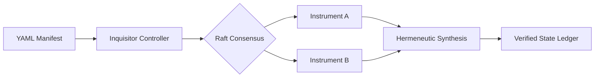
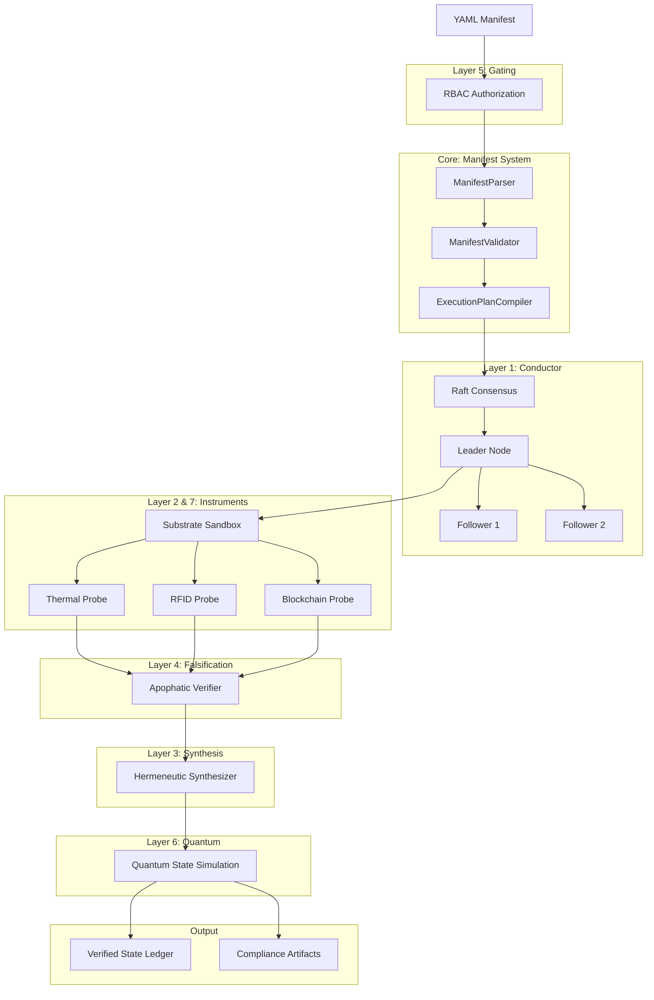

# Architecture Overview

## Introduction

The Apparatus System Harness is a Kubernetes-native framework for distributed inquiry and analysis systems. It implements a declarative, manifest-driven approach that eliminates configuration drift and ensures immutable provenance tracking across distributed systems.

## Manifest-Over-Code Philosophy

The system state is **entirely defined by declarative YAML manifests**, ensuring:

- **Zero Configuration Drift**: Runtime state always matches declared intent
- **Immutable Audit Trails**: Every state transition is version-controlled and cryptographically verifiable
- **Reproducible Deployments**: Identical manifests produce identical systems across environments
- **GitOps-Native**: All changes flow through pull requests with automated validation

### Example Manifest

```yaml
# Example: Inquiry Manifest defines both infrastructure AND behavior
apiVersion: apparatus.wadelabs.io/v1
kind: InquiryManifest
metadata:
  name: cold-chain-verification
spec:
  instruments:
    - type: thermal
      probeInterval: 10s
    - type: rfid
      probeInterval: 30s
  arbitration:
    engine: hermeneutic
    consensus: raft
```

## High-Level Architecture Diagram



## Core Components

### 1. Manifest Parser
- **Location**: `src/inquisitor/core/manifest_system/parser.py`
- **Purpose**: Parse YAML/dict manifests with nested configurations
- **Capabilities**:
  - YAML file parsing with proper encoding handling
  - Nested configuration support
  - Validation preparation for downstream processing
  - Error handling with detailed error messages

### 2. Manifest Validator
- **Location**: `src/inquisitor/core/manifest_system/validator.py`
- **Purpose**: Pydantic-based schema enforcement and validation
- **Capabilities**:
  - Type-safe validation using Pydantic models
  - Semantic constraint checking
  - Field-level validation with custom rules
  - Comprehensive error reporting
- **Coverage**: 97% test coverage

### 3. Execution Plan Compiler
- **Location**: `src/inquisitor/core/manifest_system/compiler.py`
- **Purpose**: Execution plan compilation and DAG generation
- **Capabilities**:
  - Protocol-aware execution planning
  - Dependency graph generation
  - Optimization for parallel execution
  - Resource allocation planning

### 4. Conductor (Orchestrator)
- **Location**: `src/inquisitor/conductor/`
- **Purpose**: Distributed orchestration with Raft consensus
- **Capabilities**:
  - High availability through Raft consensus protocol
  - Leader election and follower synchronization
  - Manifest state replication across cluster
  - Fault-tolerant inquiry execution

## Detailed Architecture Diagram



## Data Flow

1. **Manifest Submission**: User defines inquiry as YAML manifest
2. **Authorization**: RBAC gating validates tenant permissions (Layer 5)
3. **Parsing**: Manifest parsed into structured data (Core)
4. **Validation**: Schema validation and semantic checks (Core)
5. **Compilation**: Execution plan generated with DAG (Core)
6. **Consensus**: Raft leader replicates state across cluster (Layer 1)
7. **Instrumentation**: Sandboxed probes execute measurements (Layers 2 & 7)
8. **Falsification**: Invalid data excluded via axiom checking (Layer 4)
9. **Synthesis**: Multi-source arbitration finds ground truth (Layer 3)
10. **Quantum Simulation**: Probabilistic tracking handles uncertainty (Layer 6)
11. **Output**: Verified state ledger and compliance artifacts generated

## Performance & Resilience

- **Fault-Tolerant Persistence**: All inquiry manifests replicated across Raft cluster
- **Sanitized Probes**: Every instrument runs in sandboxed environment
- **Arbitrated Truth**: No single sensor can compromise system integrity
- **Zero-Shadow-State**: All state transitions explicitly defined in version-controlled manifests

## Production Case Study

The framework uses pharmaceutical cold-chain logistics as a reference implementation—a domain where micro-fluctuations in temperature or humidity provide measurable test cases for distributed state verification.

## Governance & Alignment

Apparatus enforces a "Zero-Shadow-State" policy, preventing any system transitions that are not explicitly defined in a version-controlled manifest. All distributed audit logs are anonymized at the substrate level to ensure data privacy while maintaining cryptographic integrity.

## Related Documentation

- [Seven Layers Deep Dive](layers.md)
- [Manifest Schema Reference](manifest-schema.md)
- [Local Development Guide](local-quickstart.md)
- [Kubernetes Deployment](deployment.md)
